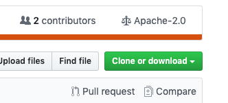
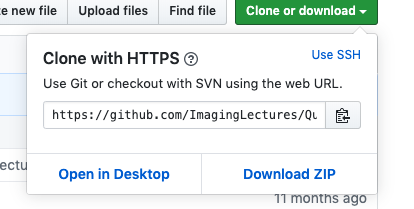

# Exercises
## General Information
The exercises are based on the lectures and take place in the same room after the lecture completes. Links to the exercises are provieded with the lecture slides in the [weekly plan](weeklyplan.md) The exercises are designed to offer a tiered level of understanding based on the background of the student. Most exercises are prepared as python notebooks that guides you step by step through the exercises. New python commands will be introduced when needed and links to the manual pages will be provided. This is not a course on python programming, you will learn to use this powerful language for different image processing tasks throughout the course. 

### Install Python

If you use colab, kaggle or mybinder you won't need python on your own machine but if you want to set it up in the same way the class has you can follow the instructions shown in the video [here](https://youtu.be/bnTCLLSpyf0) and below
1. Install Anaconda Python. You find instructions here: https://docs.anaconda.com/anaconda/install/
1. Download the course from github as a zip file
1. Extract the zip file
1. Open a terminal (or command prompt on windows)
1. Go to the root folder inside the course directory (something like: `Downloads/Quantitative-Big-Imaging-2021-master`)
1. Install the environment
1. `conda env create -f environment.yml -n qbi2021`
1. Activate the environment `conda activate qbi2021` or `activate qbi2021`
1. Start python `jupyter notebook`

### Install Git and clone the lecturematerial

1. Follow the instructions to [install git](https://www.atlassian.com/git/tutorials/install-git).
2. Clone the lecture repository.
  1. Go to the github page for [QBI lecture material](https://github.com/ImagingLectures/Quantitative-Big-Imaging-2021)
  2. Click the clone button 
  3. Copy the path 
  4. Windows: open 'git bash', MacOS/Linux: open a terminal.
  5. Go to the folder where you want to place the lecture material.
  6. Type: ```git clone <paste the repository path here> ```, press enter and wait...
  
Now you should have a folder called Quantitative-Big-Imaging-2021 at location where you called the clone.

#### Update from git with the latest changes
1. Open a terminal 
2. Go to the repository folder 
3. Type ```git pull``` and wait.
4. The local folder is updated with the latest changes.
  

## Assistance
The exercises will be supported by Stefano van Gogh and Anders Kaestner right after the lectures on thursday. For further support please contact us for an appointment.

## Online Tools
The exercises will be available on Kaggle as 'Datasets' and we will be using mybinder as stated above.
